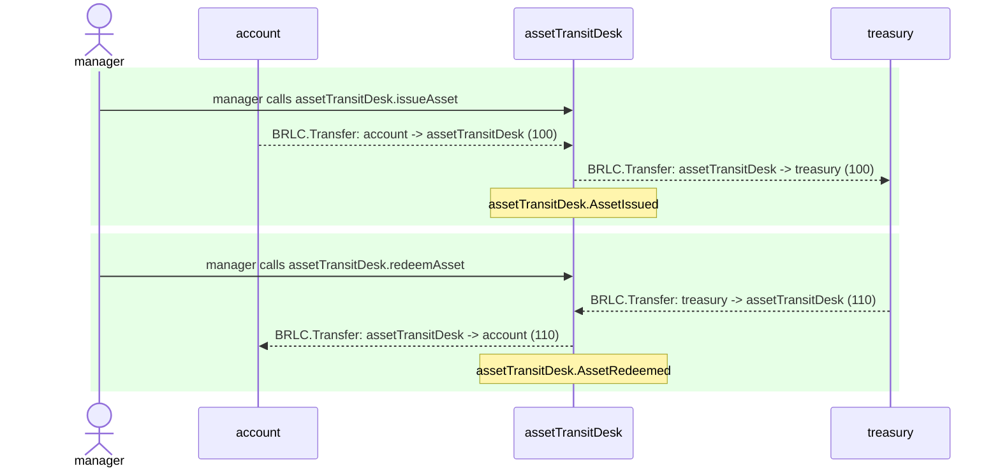
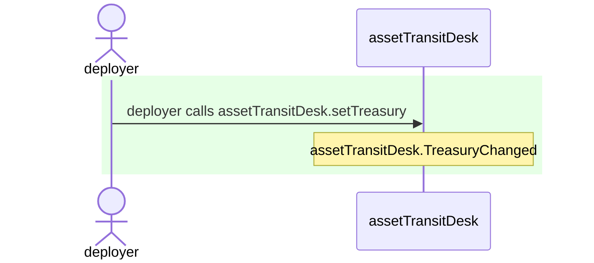

# AssetTransitDesk.test

## Usage example

| Idx | Caller | Contract | Name | Args |
| --- | ------ | -------- | ---- | ---- |
| 1 | manager | assetTransitDesk | issueAsset | [0x69737375..0000000000, account, 100] |
| 2 | manager | assetTransitDesk | redeemAsset | [0x72656465..0000000000, account, 100, 10] |



<details>
<summary>Step 0: assetTransitDesk.issueAsset</summary>

- **type**: methodCall
- **caller**: manager
- **args**: `{
  "assetIssuanceId": "0x69737375..0000000000",
  "buyer": "account",
  "principalAmount": "100"
}`

**Events**

| # | Contract | Event | Args |
| - | -------- | ----- | ---- |
| 1 | BRLC | Transfer | `[account, assetTransitDesk, 100]` |
| 2 | BRLC | Transfer | `[assetTransitDesk, treasury, 100]` |
| 3 | assetTransitDesk | AssetIssued | `[0x69737375..0000000000, account, 100]` |

**Balances**

**Token:** BRLC
| Holder | Balance |
| ------ | ------- |
| assetTransitDesk | 0 |
| treasury | 10100 |
| BRLC | 0 |
| deployer | 0 |
| manager | 0 |
| account | 9900 |
| pauser | 0 |
| stranger | 0 |


**issuanceOperation**
```
 [
  1n,
  "0x3C44CdDdB6a900fa2b585dd299e03d12FA4293BC",
  100n,
]
```
**redemptionOperation**
```
 [
  0n,
  "0x0000000000000000000000000000000000000000",
  0n,
  0n,
]
```

</details>
<details>
<summary>Step 1: assetTransitDesk.redeemAsset</summary>

- **type**: methodCall
- **caller**: manager
- **args**: `{
  "assetRedemptionId": "0x72656465..0000000000",
  "buyer": "account",
  "principalAmount": "100",
  "netYieldAmount": "10"
}`

**Events**

| # | Contract | Event | Args |
| - | -------- | ----- | ---- |
| 1 | BRLC | Transfer | `[treasury, assetTransitDesk, 110]` |
| 2 | BRLC | Transfer | `[assetTransitDesk, account, 110]` |
| 3 | assetTransitDesk | AssetRedeemed | `[0x72656465..0000000000, account, 100, 10]` |

**Balances**

**Token:** BRLC
| Holder | Balance |
| ------ | ------- |
| assetTransitDesk | 0 |
| treasury | 9990 |
| BRLC | 0 |
| deployer | 0 |
| manager | 0 |
| account | 10010 |
| pauser | 0 |
| stranger | 0 |


**issuanceOperation**
```
 [
  1n,
  "0x3C44CdDdB6a900fa2b585dd299e03d12FA4293BC",
  100n,
]
```
**redemptionOperation**
```
 [
  1n,
  "0x3C44CdDdB6a900fa2b585dd299e03d12FA4293BC",
  100n,
  10n,
]
```

</details>

## Configuration

| Idx | Caller | Contract | Name | Args |
| --- | ------ | -------- | ---- | ---- |
| 1 | deployer | assetTransitDesk | setTreasury | [treasury] |



<details>
<summary>Step 0: assetTransitDesk.setTreasury</summary>

- **type**: methodCall
- **caller**: deployer
- **args**: `{
  "newTreasury": "treasury"
}`

**Events**

| # | Contract | Event | Args |
| - | -------- | ----- | ---- |
| 1 | assetTransitDesk | TreasuryChanged | `[treasury, ZERO_ADDR]` |

**Balances**

**Token:** BRLC
| Holder | Balance |
| ------ | ------- |
| assetTransitDesk | 0 |
| treasury | 0 |
| BRLC | 0 |
| deployer | 0 |
| manager | 0 |
| account | 0 |
| pauser | 0 |


**treasury**
```
"0xA51c1fc2f0D1a1b8494Ed1FE312d7C3a78Ed91C0"
```

</details>

