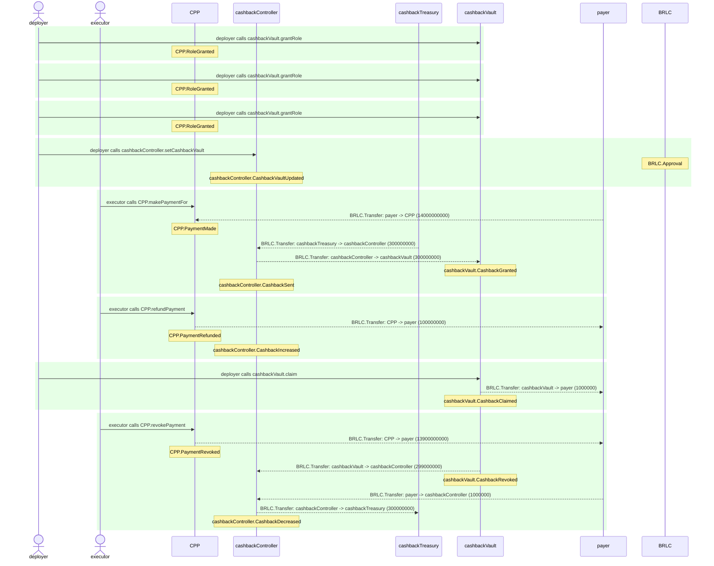

# CardPaymentProcessor.test

## Contract 'CardPaymentProcessor' with CashbackController hook connected > Snapshot scenarios > Common usage of CPP with CC and CV

| Idx | Caller | Contract | Name | Args |
| --- | ------ | -------- | ---- | ---- |
| 1 | deployer | cashbackVault | grantRole | [0xd10feaa7..70c5af57cf, deployer] |
| 2 | deployer | cashbackVault | grantRole | [0xb9c949ce..0c572ffcc2, cashbackController] |
| 3 | deployer | cashbackVault | grantRole | [0x241ecf16..7caa831b08, deployer] |
| 4 | deployer | cashbackController | setCashbackVault | [cashbackVault] |
| 5 | executor | CPP | makePaymentFor | [0x00000000..0000000001, payer, 10000000000, 4000000000, ZERO_ADDR, 0, -1, 0] |
| 6 | executor | CPP | refundPayment | [0x00000000..0000000001, 100000000] |
| 7 | deployer | cashbackVault | claim | [payer, 1000000] |
| 8 | executor | CPP | revokePayment | [0x00000000..0000000001] |

Step 0: cashbackVault.grantRole

- **type**: methodCall
- **caller**: deployer
- **args**: `{
  "role": "0xd10feaa7..70c5af57cf",
  "account": "deployer"
}`

**Events**

| # | Contract | Event | Args |
| - | -------- | ----- | ---- |
| 1 | CPP | RoleGranted | `[0xd10feaa7..70c5af57cf, deployer, deployer]` |

**Balances**

**Token:** BRLC
| Holder | Balance |
| ------ | ------- |
| CPP | 0 |
| cashbackVault | 0 |
| cashbackController | 0 |
| BRLC | 0 |
| payer | 1000000000000 |
| deployer | 0 |
| executor | 0 |
| sponsor | 2000000000000 |
| cashbackTreasury | 57896044618658097711785492504343953926634992332820282019728792003956564819967 |
| cashOutAccount | 0 |

Step 1: cashbackVault.grantRole

- **type**: methodCall
- **caller**: deployer
- **args**: `{
  "role": "0xb9c949ce..0c572ffcc2",
  "account": "cashbackController"
}`

**Events**

| # | Contract | Event | Args |
| - | -------- | ----- | ---- |
| 1 | CPP | RoleGranted | `[0xb9c949ce..0c572ffcc2, cashbackController, deployer]` |

**Balances**

**Token:** BRLC
| Holder | Balance |
| ------ | ------- |
| CPP | 0 |
| cashbackVault | 0 |
| cashbackController | 0 |
| BRLC | 0 |
| payer | 1000000000000 |
| deployer | 0 |
| executor | 0 |
| sponsor | 2000000000000 |
| cashbackTreasury | 57896044618658097711785492504343953926634992332820282019728792003956564819967 |
| cashOutAccount | 0 |

Step 2: cashbackVault.grantRole

- **type**: methodCall
- **caller**: deployer
- **args**: `{
  "role": "0x241ecf16..7caa831b08",
  "account": "deployer"
}`

**Events**

| # | Contract | Event | Args |
| - | -------- | ----- | ---- |
| 1 | CPP | RoleGranted | `[0x241ecf16..7caa831b08, deployer, deployer]` |

**Balances**

**Token:** BRLC
| Holder | Balance |
| ------ | ------- |
| CPP | 0 |
| cashbackVault | 0 |
| cashbackController | 0 |
| BRLC | 0 |
| payer | 1000000000000 |
| deployer | 0 |
| executor | 0 |
| sponsor | 2000000000000 |
| cashbackTreasury | 57896044618658097711785492504343953926634992332820282019728792003956564819967 |
| cashOutAccount | 0 |

Step 3: cashbackController.setCashbackVault

- **type**: methodCall
- **caller**: deployer
- **args**: `{
  "cashbackVault": "cashbackVault"
}`

**Events**

| # | Contract | Event | Args |
| - | -------- | ----- | ---- |
| 1 | BRLC | Approval | `[cashbackController, cashbackVault, 1157920892..3129639935]` |
| 2 | cashbackController | CashbackVaultUpdated | `[cashbackVault, ZERO_ADDR]` |

**Balances**

**Token:** BRLC
| Holder | Balance |
| ------ | ------- |
| CPP | 0 |
| cashbackVault | 0 |
| cashbackController | 0 |
| BRLC | 0 |
| payer | 1000000000000 |
| deployer | 0 |
| executor | 0 |
| sponsor | 2000000000000 |
| cashbackTreasury | 57896044618658097711785492504343953926634992332820282019728792003956564819967 |
| cashOutAccount | 0 |

Step 4: CPP.makePaymentFor

- **type**: methodCall
- **caller**: executor
- **args**: `{
  "paymentId": "0x00000000..0000000001",
  "payer": "payer",
  "baseAmount": "10000000000",
  "extraAmount": "4000000000",
  "sponsor": "ZERO_ADDR",
  "subsidyLimit": "0",
  "cashbackRate_": "-1",
  "confirmationAmount": "0"
}`

**Events**

| # | Contract | Event | Args |
| - | -------- | ----- | ---- |
| 1 | BRLC | Transfer | `[payer, CPP, 14000000000]` |
| 2 | CPP | PaymentMade | `[0x00000000..0000000001, payer, 0x01000000..0342770c00]` |
| 3 | BRLC | Transfer | `[cashbackTreasury, cashbackController, 300000000]` |
| 4 | BRLC | Transfer | `[cashbackController, cashbackVault, 300000000]` |
| 5 | cashbackVault | CashbackGranted | `[payer, cashbackController, 300000000, 300000000]` |
| 6 | cashbackController | CashbackSent | `[0x00000000..0000000001, payer, 2, 300000000]` |

**Balances**

**Token:** BRLC
| Holder | Balance |
| ------ | ------- |
| CPP | 14000000000 |
| cashbackVault | 300000000 |
| cashbackController | 0 |
| BRLC | 0 |
| payer | 986000000000 |
| deployer | 0 |
| executor | 0 |
| sponsor | 2000000000000 |
| cashbackTreasury | 57896044618658097711785492504343953926634992332820282019728792003956264819967 |
| cashOutAccount | 0 |

Step 5: CPP.refundPayment

- **type**: methodCall
- **caller**: executor
- **args**: `{
  "paymentId": "0x00000000..0000000001",
  "refundingAmount": "100000000"
}`

**Events**

| # | Contract | Event | Args |
| - | -------- | ----- | ---- |
| 1 | BRLC | Transfer | `[CPP, payer, 100000000]` |
| 2 | CPP | PaymentRefunded | `[0x00000000..0000000001, payer, 0x01000000..0005f5e100]` |
| 3 | cashbackController | CashbackIncreased | `[0x00000000..0000000001, payer, 3, 0, 300000000]` |

**Balances**

**Token:** BRLC
| Holder | Balance |
| ------ | ------- |
| CPP | 13900000000 |
| cashbackVault | 300000000 |
| cashbackController | 0 |
| BRLC | 0 |
| payer | 986100000000 |
| deployer | 0 |
| executor | 0 |
| sponsor | 2000000000000 |
| cashbackTreasury | 57896044618658097711785492504343953926634992332820282019728792003956264819967 |
| cashOutAccount | 0 |

Step 6: cashbackVault.claim

- **type**: methodCall
- **caller**: deployer
- **args**: `{
  "account": "payer",
  "amount": "1000000"
}`

**Events**

| # | Contract | Event | Args |
| - | -------- | ----- | ---- |
| 1 | BRLC | Transfer | `[cashbackVault, payer, 1000000]` |
| 2 | cashbackVault | CashbackClaimed | `[payer, deployer, 1000000, 299000000]` |

**Balances**

**Token:** BRLC
| Holder | Balance |
| ------ | ------- |
| CPP | 13900000000 |
| cashbackVault | 299000000 |
| cashbackController | 0 |
| BRLC | 0 |
| payer | 986101000000 |
| deployer | 0 |
| executor | 0 |
| sponsor | 2000000000000 |
| cashbackTreasury | 57896044618658097711785492504343953926634992332820282019728792003956264819967 |
| cashOutAccount | 0 |

Step 7: CPP.revokePayment

- **type**: methodCall
- **caller**: executor
- **args**: `{
  "paymentId": "0x00000000..0000000001"
}`

**Events**

| # | Contract | Event | Args |
| - | -------- | ----- | ---- |
| 1 | BRLC | Transfer | `[CPP, payer, 13900000000]` |
| 2 | CPP | PaymentRevoked | `[0x00000000..0000000001, payer, 0x01000000..033c812b00]` |
| 3 | BRLC | Transfer | `[cashbackVault, cashbackController, 299000000]` |
| 4 | cashbackVault | CashbackRevoked | `[payer, cashbackController, 299000000, 0]` |
| 5 | BRLC | Transfer | `[payer, cashbackController, 1000000]` |
| 6 | BRLC | Transfer | `[cashbackController, cashbackTreasury, 300000000]` |
| 7 | cashbackController | CashbackDecreased | `[0x00000000..0000000001, payer, 1, 300000000, 0]` |

**Balances**

**Token:** BRLC
| Holder | Balance |
| ------ | ------- |
| CPP | 0 |
| cashbackVault | 0 |
| cashbackController | 0 |
| BRLC | 0 |
| payer | 1000000000000 |
| deployer | 0 |
| executor | 0 |
| sponsor | 2000000000000 |
| cashbackTreasury | 57896044618658097711785492504343953926634992332820282019728792003956564819967 |
| cashOutAccount | 0 |

