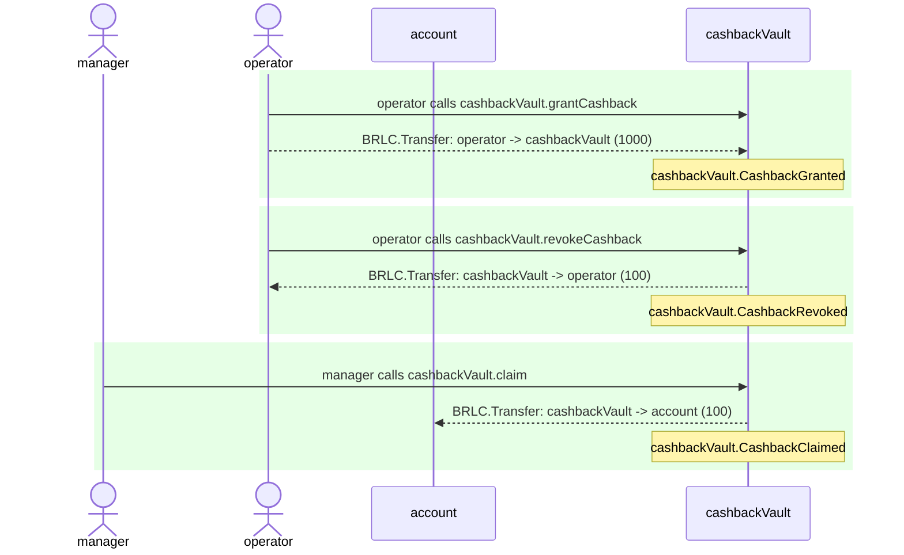
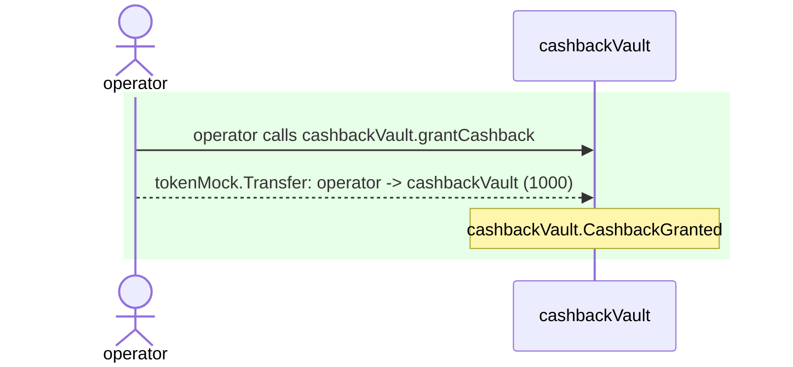

# CashbackVault.test

## Contract 'CashbackVault' > BDD scenarios > snapshot scenario test

| Idx | Caller | Contract | Name | Args |
| --- | ------ | -------- | ---- | ---- |
| 1 | operator | cashbackVault | grantCashback | [account, 1000] |
| 2 | operator | cashbackVault | revokeCashback | [account, 100] |
| 3 | manager | cashbackVault | claim | [account, 100] |



<details>
<summary>Step 0: cashbackVault.grantCashback</summary>

- **type**: methodCall
- **caller**: operator
- **args**: `{
  "account": "account",
  "amount": "1000"
}`

**Events**

| # | Contract | Event | Args |
| - | -------- | ----- | ---- |
| 1 | BRLC | Transfer | `[operator, cashbackVault, 1000]` |
| 2 | cashbackVault | CashbackGranted | `[account, operator, 1000, 1000]` |

**Balances**

**Token:** BRLC
| Holder | Balance |
| ------ | ------- |
| cashbackVault | 1000 |
| BRLC | 0 |
| account | 0 |
| manager | 0 |
| operator | 57896044618658097711785492504343953926634992332820282019728792003956564818967 |


**accountCashbackState**
```
Object {
  "balance": 1000n,
  "totalClaimed": 0n,
}
```

</details>
<details>
<summary>Step 1: cashbackVault.revokeCashback</summary>

- **type**: methodCall
- **caller**: operator
- **args**: `{
  "account": "account",
  "amount": "100"
}`

**Events**

| # | Contract | Event | Args |
| - | -------- | ----- | ---- |
| 1 | BRLC | Transfer | `[cashbackVault, operator, 100]` |
| 2 | cashbackVault | CashbackRevoked | `[account, operator, 100, 900]` |

**Balances**

**Token:** BRLC
| Holder | Balance |
| ------ | ------- |
| cashbackVault | 900 |
| BRLC | 0 |
| account | 0 |
| manager | 0 |
| operator | 57896044618658097711785492504343953926634992332820282019728792003956564819067 |


**accountCashbackState**
```
Object {
  "balance": 900n,
  "totalClaimed": 0n,
}
```

</details>
<details>
<summary>Step 2: cashbackVault.claim</summary>

- **type**: methodCall
- **caller**: manager
- **args**: `{
  "account": "account",
  "amount": "100"
}`

**Events**

| # | Contract | Event | Args |
| - | -------- | ----- | ---- |
| 1 | BRLC | Transfer | `[cashbackVault, account, 100]` |
| 2 | cashbackVault | CashbackClaimed | `[account, manager, 100, 800]` |

**Balances**

**Token:** BRLC
| Holder | Balance |
| ------ | ------- |
| cashbackVault | 800 |
| BRLC | 0 |
| account | 100 |
| manager | 0 |
| operator | 57896044618658097711785492504343953926634992332820282019728792003956564819067 |


**accountCashbackState**
```
Object {
  "balance": 800n,
  "totalClaimed": 100n,
}
```

</details>

## scenario with custom name

| Idx | Caller | Contract | Name | Args |
| --- | ------ | -------- | ---- | ---- |
| 1 | operator | cashbackVault | grantCashback | [account, 1000] |



<details>
<summary>Step 0: cashbackVault.grantCashback</summary>

- **type**: methodCall
- **caller**: operator
- **args**: `{
  "account": "account",
  "amount": "1000"
}`

**Events**

| # | Contract | Event | Args |
| - | -------- | ----- | ---- |
| 1 | tokenMock | Transfer | `[operator, cashbackVault, 1000]` |
| 2 | cashbackVault | CashbackGranted | `[account, operator, 1000, 1000]` |

**Balances**

**Token:** tokenMock
| Holder | Balance |
| ------ | ------- |
| cashbackVault | 1000 |
| tokenMock | 0 |
| account | 0 |
| manager | 0 |
| operator | 57896044618658097711785492504343953926634992332820282019728792003956564818967 |


</details>

